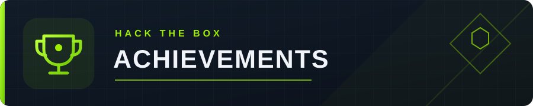

## Main Projects
#

#### Cybersecurity:
### Herodium

Developer-oriented Linux security framework for building and testing broader defensive tooling.

[Repository](https://github.com/ramnezer/herodium)
#
#### Technological research:
### VRAMz 

[Repository](https://github.com/ramnezer/vramz)

VRAMZ is an experimental C++ userspace runtime for NVIDIA GPUs.
It explores keeping colder application data compressed in GPU memory.
#
#
#

<table>
  <tr>
    <td></td>
    <td></td>
  </tr>
  <tr>
    <td></td>
    <td></td>
  </tr>
</table>

## Contact

- Location: Israel
- Email: ramnezer1001@gmail.com
